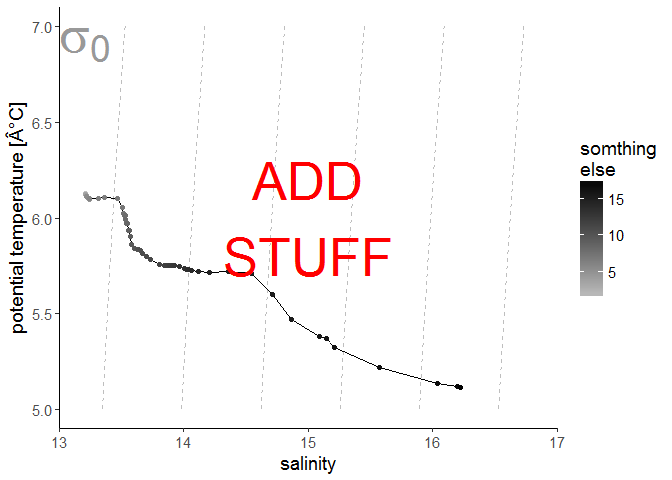

README
================
David Kaiser
2018/01/16

create a TS diagram as a ggplot
-------------------------------

### Description

A TS diagram, Temperature-Salinity-diagram, plots the **potential temperature** of water over **salinity**. Many water masses have characteristic shapes in a TS diagram, which is used in physical oceanography to identify water masses and their mixing (see e.g. <https://doi.org/10.1016/S0422-9894(08)71172-3>).

This function requires the input of vectors of **potential temperature** and **salinity**. The *gws* package is used to calculate potential density for plotting of isopycnals (contours of the same density). This calculation requires a **reference pressure**, which defaults to 0, the sea surface.

A third vector can optionally be supplied to **col.par** to be plotted in color, and can be named with a string supplied to **col.name**.

### Arguments

*sal* -- vector of salinity values

*pot.temp* -- vector of potential temperature values in degree C

*reference.p = 0* -- reference pressure which was also used to calculate potential temperature

*col.par = NA* -- optional vector of a parameter to be displayed as color of the TS-pairs

*col.name = "col.par"* -- optional name of the "col.par" to be used on the color bar

### Plot

``` r
example <- read.csv("example_data/example_data.csv")

head(example)
```

    ##   X depth potential.temperature salinity
    ## 1 1  1.50                6.1272  13.2087
    ## 2 2  1.75                6.1245  13.2115
    ## 3 3  2.00                6.1236  13.2128
    ## 4 4  2.25                6.1227  13.2126
    ## 5 5  2.50                6.1229  13.2145
    ## 6 6  2.75                6.1224  13.2122

The data will be plotted using the *ggplot2* package.

``` r
ggTS_DK(sal = example$salinity, 
        pot.temp = example$potential.temperature, 
        reference.p = 0,
        col.par = example$depth, 
        col.name = "depth [m]")
```


**NOTE**: the special "Â" character does not show when the function is used in R, this seems to be a markdown/knitr problem

Since the result is a ggplot, it can be altered and amended:

``` r
p1 <- ggTS_DK(sal = example$salinity, 
        pot.temp = example$potential.temperature, 
        reference.p = 0,
        col.par = example$depth, 
        col.name = "depth [m]")
p1 + scale_color_gradient(low = "grey", high = "black", name = "somthing\nelse") +
      annotate(geom = "text", x = 15, y = 6, color = "red", size = 14, label = "ADD\nSTUFF")
```



### in preparation

**Isopycnal labels**: Currently the isopycnals are not labeled in the example. For cases in which the isopycnals run fairly horizontally through the plot and cut through its right side edge, and in which the calculated potential density range is large enough, this works already. But this is not the case for the example data.
