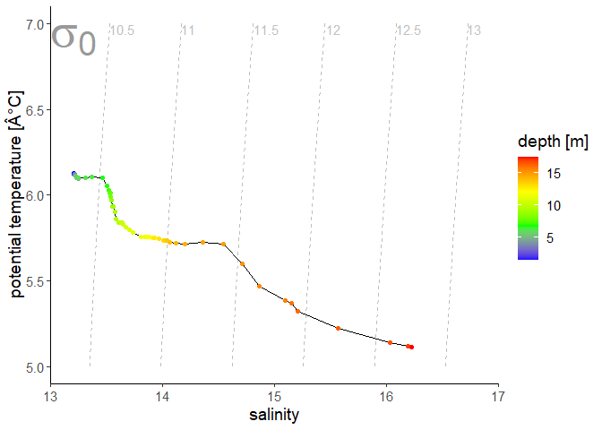
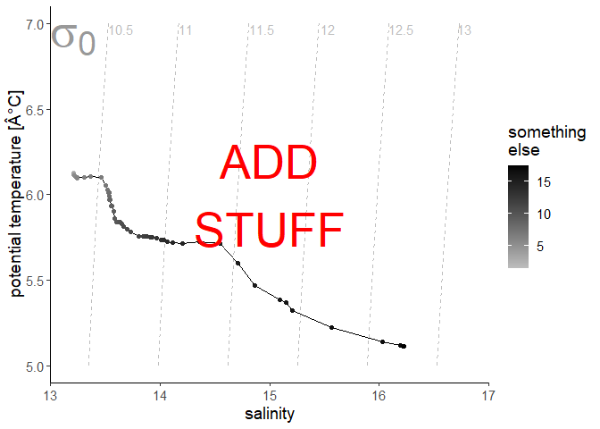

create a TS diagram as a ggplot
================
David Kaiser
2018/01/16

### Description

A TS diagram, Temperature-Salinity-diagram, plots the **potential temperature** of water over **salinity**. Many water masses have characteristic shapes in a TS diagram, [which is used in physical oceanography to identify water masses and their mixing.](https://doi.org/10.1016/S0422-9894(08)71172-3)

This function requires the input of vectors of **potential temperature** and **salinity**. The *gws* package is used to calculate potential density for plotting of isopycnals (contours of the same density). This calculation requires a **reference pressure**, which defaults to 0, the sea surface.

A third vector can optionally be supplied to **col.par** to be plotted in color, and can be named with a string supplied to **col.name**.

### Arguments

*sal* -- vector of salinity values

*pot.temp* -- vector of potential temperature values in degree C

*reference.p = 0* -- reference pressure which was also used to calculate potential temperature

*col.par = NA* -- optional vector of a parameter to be displayed as color of the TS-pairs

*col.name = "col.par"* -- optional name of the "col.par" to be used on the color bar

### Plot

``` r
example <- read.csv("example_data/example_data.csv")

head(example)
```

    ##   depth potential.temperature salinity
    ## 1  1.50                6.1272  13.2087
    ## 2  1.75                6.1245  13.2115
    ## 3  2.00                6.1236  13.2128
    ## 4  2.25                6.1227  13.2126
    ## 5  2.50                6.1229  13.2145
    ## 6  2.75                6.1224  13.2122

The data will be plotted using the *ggplot2* package.

``` r
ggTS(sal = example$salinity, 
        pot.temp = example$potential.temperature, 
        reference.p = 0,
        col.par = example$depth, 
        col.name = "depth [m]")
```



**NOTE**: the special "Â" character does not show when the function is used in R, this seems to be a markdown/knitr problem

Since the result is a ggplot, it can be altered and amended:

``` r
p1 <- ggTS(sal = example$salinity, 
        pot.temp = example$potential.temperature, 
        reference.p = 0,
        col.par = example$depth, 
        col.name = "depth [m]")
p1 + scale_color_gradient(low = "grey", high = "black", name = "something\nelse") +
      annotate(geom = "text", x = 15, y = 6, color = "red", size = 14, label = "ADD\nSTUFF")
```



Plot a TS diagram with isopycnals running more horizontally

``` r
example1 <- read.csv("example_data/example_data1.csv")

head(example1)
```

    ##   depth potential.temperature salinity
    ## 1     0              24.30924 34.36559
    ## 2    10              24.09002 34.30511
    ## 3    20              23.58654 34.32923
    ## 4    30              23.19063 34.38134
    ## 5    40              22.88482 34.44991
    ## 6    50              22.45423 34.50933

``` r
ggTS(sal = example1$salinity, 
        pot.temp = example1$potential.temperature, 
        reference.p = 0,
        col.par = example1$depth, 
        col.name = "depth [m]")
```


